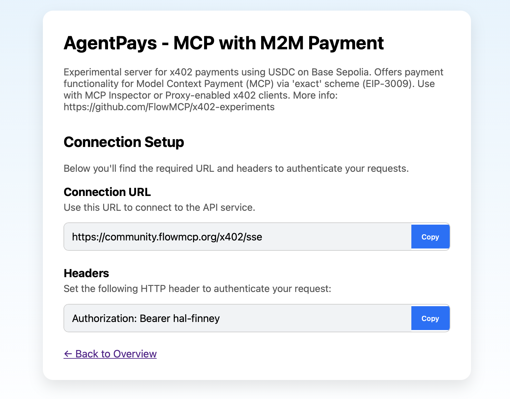

# AgentPays - M2M Payments Built into MCP

**AgentPays** is a hackathon project that enables AI agents to autonomously pay for API calls and other resources using the [x402 payment protocol](https://x402.org). By integrating Claude with a crypto payment backend and the [Model Context Protocol (MCP)](https://github.com/flowMCP), this project introduces the **first native payment enforcement system embedded directly into MCP**.

Each tool or resource can define its own payment requirements, which led to the development of:

* an `x402`-enabled MCP server
* and a local proxy client for agent-side integration

---

## 🌐 Remote x402 MCP Server



> [https://community.flowmcp.org/x402](https://community.flowmcp.org/x402)

**Experimental server for x402 payments using USDC on Base Sepolia.**
Provides payment support for Model Context Protocol (MCP) using the `'exact'` payment scheme (EIP-3009).
Can be used with the **MCP Inspector** or any **x402-capable proxy client**.

### Features

* One endpoint publishes a text file via `pinata`, requiring **0.01 test USDC**
* All other endpoints are free
* The server is publicly accessible without authentication
* Only specific tool calls may require payment

---

## 🔁 Proxy Server (SSE → STDIO)

☑️ Launches a local proxy to bridge Claude Mac's STDIO with the x402-enabled SSE server
☑️ Automatically injects signed `X-PAYMENT` headers into requests
☑️ Designed for Claude Mac, custom shells, or any agent framework

---

### 🚀 Quickstart (Claude Mac Integration)

☑️ Connects Claude Mac to:
👉 [`https://community.flowmcp.org/x402`](https://community.flowmcp.org/x402) — public payment-enforced remote server
☑️ Manages payments via proxy with automatic `X-PAYMENT` headers

#### Claude Mac Config Snippet

```json
{
  "globalShortcut": "",
  "mcpServers": {
    "x402": {
      "command": "node",
      "args": [
        "your/absolute/path/proxyserver.mjs"
      ],
      "env": {
        "SERVER_URL": "https://community.flowmcp.org/x402",
        "BEARER_TOKEN": "Bearer hal-finney",
        "SILENT": "true"
      }
    }
  }
}
```

✅ No login
✅ No setup
✅ Just test it

---

## 🧩 Modules Built for the Hackathon

The AgentPays infrastructure was custom-built for this hackathon. Core modules like `x402-core` and `x402-mcp-middleware` were created from scratch. Existing tools like `FlowMCP` and the `community-server` were extended to support seamless payment enforcement.

All modules are live and integrated at [`community.flowmcp.org/x402`](https://community.flowmcp.org/x402).

| Module                                                                  | Description                                                                       |
| ----------------------------------------------------------------------- | --------------------------------------------------------------------------------- |
| [`x402-core`](https://github.com/FlowMCP/x402-core)                     | 🔧 Built from scratch: full client/server logic for EIP-3009-based token payments |
| [`x402-mcp-middleware`](https://github.com/FlowMCP/x402-mcp-middleware) | 🔧 Built from scratch: enforces x402 payments in Node.js Express-based AI tools   |
| [`FlowMCP`](https://github.com/FlowMCP)                                 | ♻️ Extended: tool orchestration & schema-driven agent framework                   |
| [`community-server`](https://github.com/FlowMCP/community-server)       | ♻️ Extended: hosts and integrates all modules as a live remote server             |

---

🔗 **CustomGPT: [x402 Payment Expert](https://chatgpt.com/g/g-6852ce0f854c81919ee022e3f5658971-x402-payment-expert)**
Interact with a GPT agent specialized in the x402 payment stack.

---

## 🧠 Architecture Overview

```text
 LOCAL MACHINE                                      |                                     INTERNET
───────────────────────────────────────────────────┼────────────────────────────────────────────────────────────
┌────────┐    User Input     ┌──────────────┐   Tool Call   ┌────────────┐   HTTP 402   ┌──────────────┐
│  USER  │ ◀────────────────▶│  Claude Mac  │ ◀────────────▶│ Proxy Node │ ◀──────────▶ │  MCP Server  │
└────────┘                   └──────────────┘               │ x402 Client│               │ x402 Gateway │
                                                            └────────────┘               └──────────────┘
                                                                ▲   ▲
                                                                │   │
                                           Signed Payment Header   JSON Response / Stream
```

---

Let me know if you want this exported as a file, turned into a webpage, or styled with custom formatting (like GitHub Pages or Notion).

